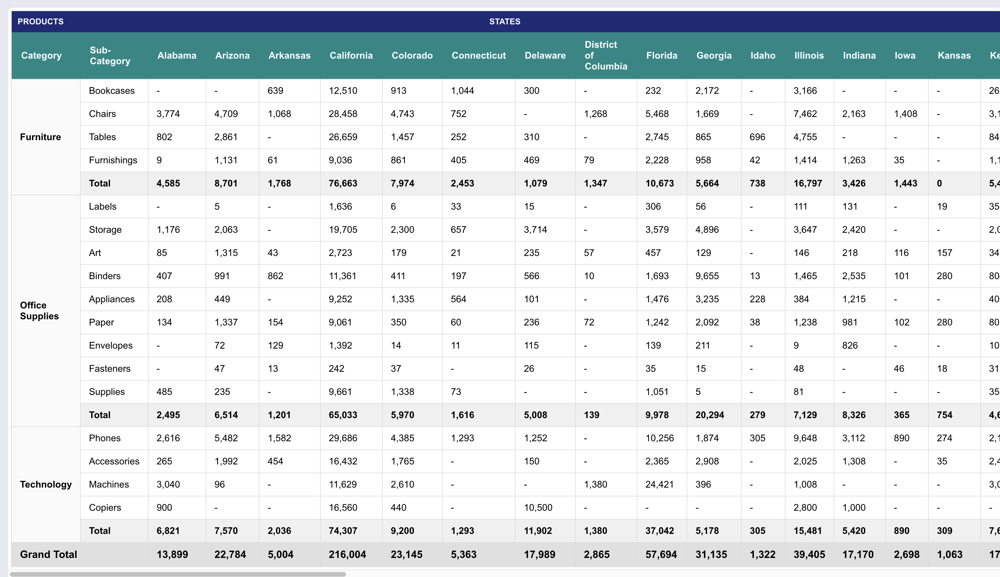

# Pivot Table Application

A React-based application that displays and analyzes data using a pivot table interface. Built with TypeScript, Redux Toolkit, and modern React practices.



## Features

- Interactive pivot table visualization
- Real-time data updates
- Error handling and loading states
- Responsive design

## Prerequisites

- Node.js (v18 or higher)
- Yarn package manager

## Getting Started

### Installation

1. Fork this repository to your GitHub account
2. Clone your forked repository:
```bash
git clone https://github.com/YOUR_USERNAME/crisp-take-home.git
cd crisp-take-home
```

3. Install dependencies:
```bash
yarn install
```

### Git Hooks Setup

This project uses Husky for git hooks to ensure code quality. After installation, you need to:

1. Install Husky git hooks:
```bash
yarn prepare
```

This will set up pre-commit hooks that run:
- ESLint checks
- Prettier formatting
- TypeScript type checking

### Available Scripts

- `yarn start` - Runs the app in development mode
- `yarn build` - Builds the app for production
- `yarn test` - Runs the test suite
- `yarn test:watch` - Runs tests in watch mode
- `yarn format` - Formats code using Prettier
- `yarn lint` - Runs ESLint
- `yarn lint:fix` - Fixes ESLint issues
- `yarn lint:format` - Formats and fixes linting issues

## Project Structure

```
src/
├── api/           # API calls and endpoints
├── components/    # React components
├── constants/     # Application constants and types
├── mocks/         # Mock data for testing and development
├── redux/         # Redux store, actions, and reducers
├── utils/         # Utility functions and helpers
├── index.tsx      # Application entry point
├── index.css      # Global styles
├── setupTests.ts  # Jest test setup
```

## Development

This project uses:
- React 19
- TypeScript
- Redux Toolkit
- ESLint and Prettier for code quality
- Husky for git hooks
- Jest for testing

### Code Quality

The project includes:
- ESLint configuration for code linting
- Prettier for code formatting
- Husky pre-commit hooks
- TypeScript for type safety

## Testing

Run the test suite:
```bash
yarn test
```

For watch mode:
```bash
yarn test:watch
```

## Contributing

1. Create a new branch for your feature
2. Make your changes
3. Run tests and ensure they pass
4. Submit a pull request

